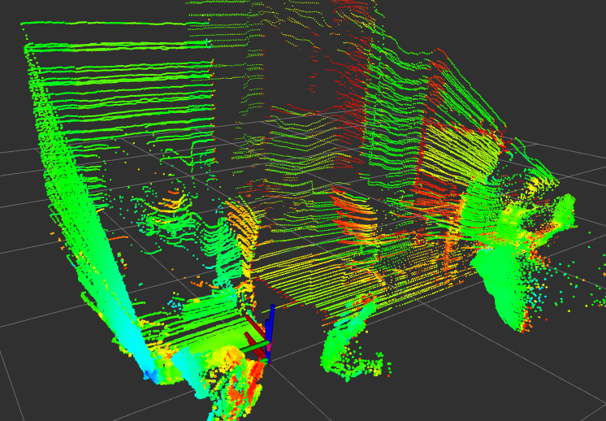

# lidar-mount
Physical implementation of lidar mount for McGill Robotics.

# Requirements
You need to install rosserial and rosserial_arduino,
also you need to setup your redBoard udev rules.
You can just run the rover setup script and it deals with it.

# Running

## Pre-requisites
- You need to have a redboard hooked up to your computer with the correct udev
rules in place.
- Said redboard needs to be connected to a CUI encoder correctly via SPI,
for which the pinnout is described in `firmware/firmware.h`.
- The computer needs to be connected to the Hokuyo Laser Range Finder, and
ideally this laser range finder should be mounted on its mount with the servo
hooked up to the redboard. **NOTE: The Lidar requires a 12V power supply, be
sure that the lidar is being provided with adequate current. Based on the
current wiring, Blue is +ve and black is ground. Check with someone who knows
what they're doing before messing around with this.**


## Building and flashing the firmware
- In the catkin_ws directory, issue the command 
```bash
catkin_make
``` 
to build.
- Still in that directory, issue the command 
```bash
catkin_make lidar_mount_firmware_firmware-upload
```

## Running and viewing in RVIZ
- To run, simply issue
```bash
roslaunch lidar_mount lidar_mount.launch viz:=true bag_playback:=false
``` 
to get all the core processes going.
Parameter meaning:
- viz: If true, launch rviz with proper configuration file. Set to false if you
don't want to visualize the output.
- bag_playback: Set to true if you are using bagged data from a previous run
of this setup. Considering the state of this project, do not assume old bags
will work.

If everything works correctly, you should see something like the following:


# Testing and Debugging

Since there is limited debugging support in rosserial, we need to add in test
publishers when we want to test the hardware.

Testing is under construction.
